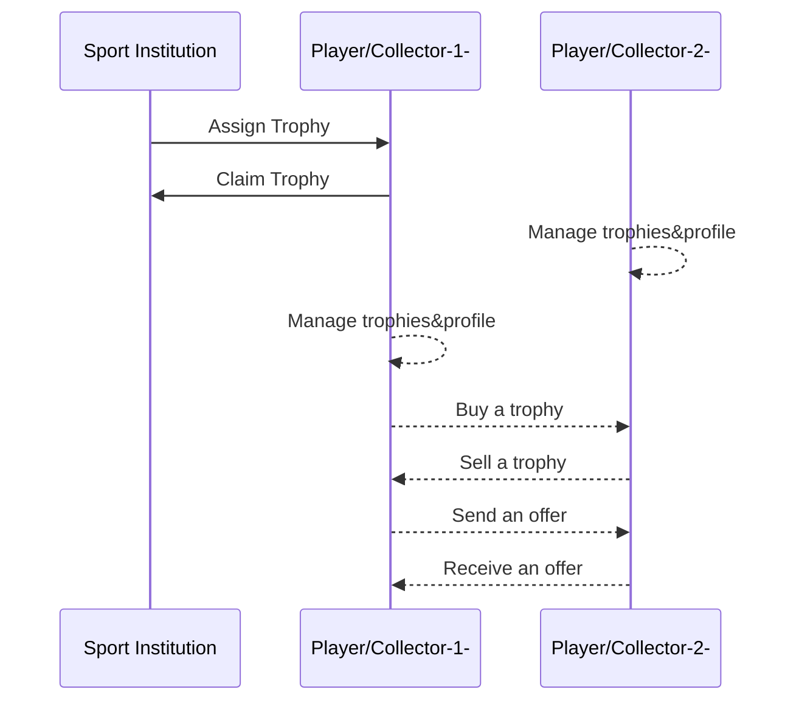

# BLOVIZE

Blovize is a web app where sport institutions can create virtual trophies as a NFT in Ethereum Blockchain and users can share, collect, buy and sell their trophies. Usually users will be sports players, but Blovize also accept collector users. 

## Technologies used

- HTML5
- CSS3
- JavaScript
- Styled Components
- Redux
- React
- Firebase:
    - Authenticaction
    - Firestore
    - Storage
    - Hosting

## How it works

Blovize has 2 kind of users: sport institutions and player or collectors. Each one can do some actions:

- #### Sport Institution
	- Create and assign trophies to players.
	- Control the states of the trophies. 
	- Send email to the trophy claimer.
	- Check the trophies that the instiutios has create.
	- Change the profile data.

- #### Player/Collector
	-  Share their trophies.
	- Change the state of the trophies in order to receive offers or sale it.
	- Buy trophies to collect.
	- Create buy offers in order to add a trophy to the collection.
	- Manage the created and received offers.
	- Claim trophies that the player has won.
	- Save favourite trophies.
	- Change the profile data.

### Database Collections
- Profiles: Save all the users data.
- TrophyChildren: Players/Collector trophies data.
- TrophyFather: Sport Institutions trophies data.
- Offers: Buy offers data between users.

### How it works diagram

## Images

## Future additions

- NFTs Ethereum Blockchain part
- Full back end
- Responsive design

